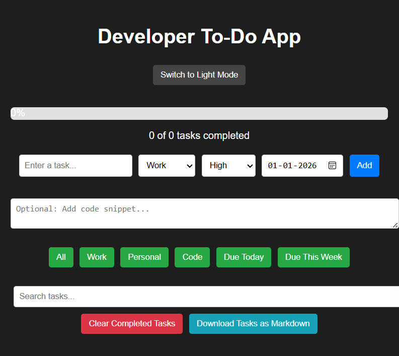
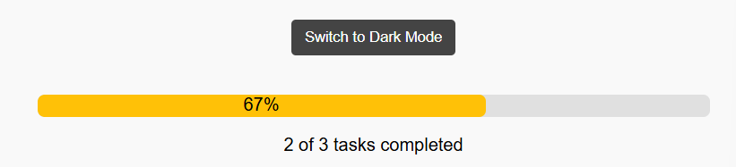
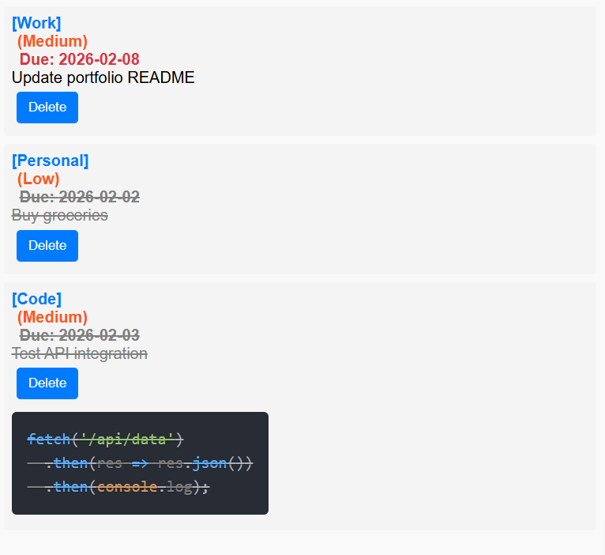

# 📝 Developer To‑Do App


A **feature‑rich React productivity app** designed for developers.  
It supports task management, code snippets, categories, priorities, due dates, drag‑and‑drop reordering, progress tracking, and Markdown export.

---

## 🚀 Live Demo
👉 [View App on GitHub Pages](https://sunayanapamula-gif.github.io/to-do-app)

---

## ✨ Features

- 🔍 **Search bar** to quickly find tasks/snippets  
- 🎯 **Priority levels** (High, Medium, Low)  
- 📅 **Due dates** + filters for Today / This Week  
- 🗂️ **Categories** (Work, Personal, Code)  
- 🌗 **Dark/Light mode toggle**  
- 📊 **Progress bar** with dynamic colors + percentage  
- 📥 **Markdown export** for sharing tasks  
- 🔄 **Drag‑and‑drop reordering** for flexible prioritization  
- 🧹 **Clear completed tasks** button  

---

## 📸 Screenshots

### Light Mode


### Dark Mode


### Progress Bar


### Drag & Drop Reordering


---

## 🛠️ Installation

Clone the repo and install dependencies:

```bash
git clone https://github.com/sunayanapamula-gif/to-do-app.git
cd to-do-app
npm install
npm start
